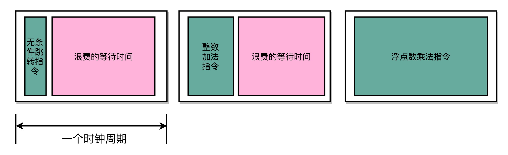

#### 选题

* CPU既传统又现代。从传统的结构而言，CPU实现冯氏结构，从功能上一般可以分为取指、译码、执行、访存和回写5 个步骤来实现通用型的计算。但经过几十年的快速发展，现代CPU 普遍采用超级流水线和超标量来提升算力。请调研当前超级流水线或者超标量设计中的瓶颈，并从体系结构的角度分析可行的解决方案。

#### 内容

##### 愿得一人心，白首不相离：单指令周期处理器

* 一条 CPU 指令的执行，是由“取得指令（Fetch）- 指令译码（Decode）- 执行指令（Execute） ”这样三个步骤组成的。这个执行过程，至少需要花费一个时钟周期。因为在取指令的时候，我们需要通过时钟周期的信号，来决定计数器的自增。

* 那么，很自然地，我们希望能确保让这样一整条指令的执行，在一个时钟周期内完成。这样，我们一个时钟周期可以执行一条指令，CPI 也就是 1，看起来就比执行一条指令需要多个时钟周期性能要好。采用这种设计思路的处理器，就叫作单指令周期处理器（Single Cycle Processor），也就是在一个时钟周期内，处理器正好能处理一条指令。

* 不过，我们的时钟周期是固定的，但是指令的电路复杂程度是不同的，所以实际一条指令执行的时间是不同的。

* 不同指令的执行时间不同，但是我们需要让所有指令都在一个时钟周期内完成，那就只好把时钟周期和执行时间最长的那个指令设成一样。这就好比学校体育课 1000 米考试，我们要给这场考试预留的时间，肯定得和跑得最慢的那个同学一样。因为就算其他同学先跑完，也要等最慢的同学跑完，我们才能进行下一项活动。

*  

        

单指令处理器的时钟周期

    

    快速执行完成的指令，需要等待满一个时钟周期，才能执行下一条指令

* 所以，在单指令周期处理器里面，无论是执行一条用不到 ALU 的无条件跳转指令，还是一条计算起来电路特别复杂的浮点数乘法运算，我们都等要等满一个时钟周期。在这个情况下，虽然 CPI 能够保持在 1，但是我们的时钟频率却没法太高。因为太高的话，有些复杂指令没有办法在一个时钟周期内运行完成。那么在下一个时钟周期到来，开始执行下一条指令的时候，前一条指令的执行结果可能还没有写入到寄存器里面。那下一条指令读取的数据就是不准确的，就会出现错误。

* 

        

指令的写入和读取

    

    一条指令的写入，在后一条指令的读取之前。因此单指令周期处理器，可以认为其时钟周期是执行最复杂的指令的时间。

##### 无可奈何花落去，似曾相识燕归来：现代处理器的流水线设计

* 目前应用在各个领域的CPU都不是单指令周期处理器，其采用了一种叫做指令流水线（Instruction Pipeline）的技术。

* CPU执行一条指令的过程被拆分成“取指令、译码、执行”三大步骤。更细分一些，执行的过程，还包含从寄存器或者内存中读取数据，通过 ALU 进行运算，把结果写回到寄存器或者内存中。

* CPU的执行执行过程：在取指令的时候，通过一个译码器把数据从内存里面取出来，写入到寄存器中；在指令译码的时候，通过另外一个译码器，把指令解析成对应的控制信号、内存地址和数据；到了指令执行的时候，通过一个完成计算工作的 ALU。这些步骤都是由独立的组合逻辑电路来完成的。

* 

        

流水线执行示意图

    

    通过流水线设计，这样一来，不就需要像单指令周期处理器