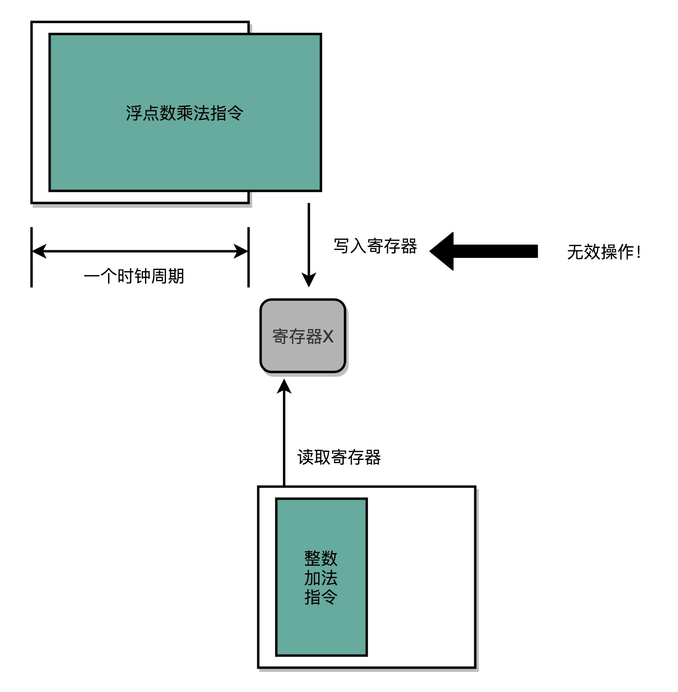
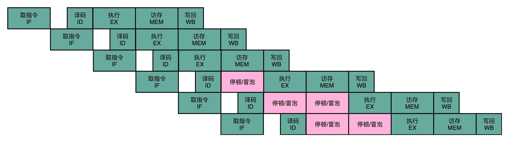
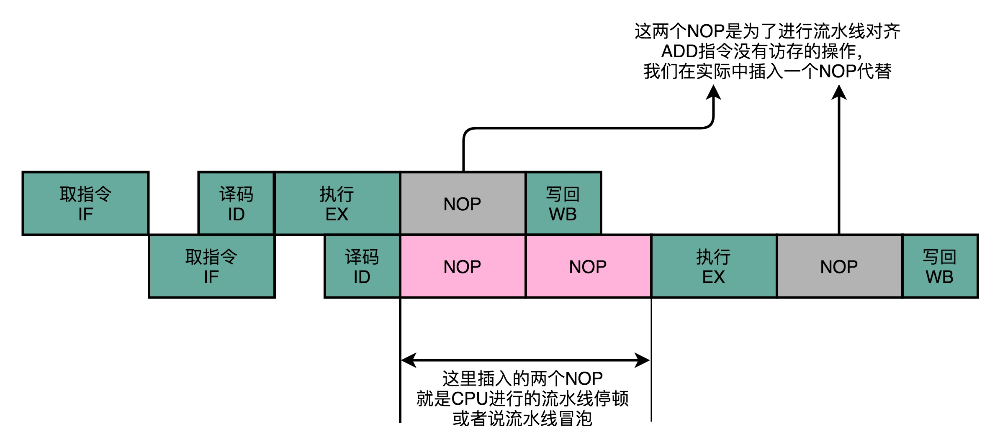

#### 选题

* CPU既传统又现代。从传统的结构而言，CPU实现冯氏结构，从功能上一般可以分为取指、译码、执行、访存和回写5 个步骤来实现通用型的计算。但经过几十年的快速发展，现代CPU 普遍采用超级流水线和超标量来提升算力。请调研当前超级流水线或者超标量设计中的瓶颈，并从体系结构的角度分析可行的解决方案。

#### 内容

##### 愿得一人心，白首不相离：单指令周期处理器

* 一条 CPU 指令的执行，是由“取得指令（Fetch）- 指令译码（Decode）- 执行指令（Execute） ”这样三个步骤组成的。这个执行过程，至少需要花费一个时钟周期。因为在取指令的时候，我们需要通过时钟周期的信号，来决定计数器的自增。

* 那么，很自然地，我们希望能确保让这样一整条指令的执行，在一个时钟周期内完成。这样，我们一个时钟周期可以执行一条指令，CPI 也就是 1，看起来就比执行一条指令需要多个时钟周期性能要好。采用这种设计思路的处理器，就叫作单指令周期处理器（Single Cycle Processor），也就是在一个时钟周期内，处理器正好能处理一条指令。

* 不过，我们的时钟周期是固定的，但是指令的电路复杂程度是不同的，所以实际一条指令执行的时间是不同的。

* 不同指令的执行时间不同，但是我们需要让所有指令都在一个时钟周期内完成，那就只好把时钟周期和执行时间最长的那个指令设成一样。这就好比学校体育课 1000 米考试，我们要给这场考试预留的时间，肯定得和跑得最慢的那个同学一样。因为就算其他同学先跑完，也要等最慢的同学跑完，我们才能进行下一项活动。

*  <div align=center>
        <center><p>单指令处理器的时钟周期</p></center>
    </div>
    快速执行完成的指令，需要等待满一个时钟周期，才能执行下一条指令

* 所以，在单指令周期处理器里面，无论是执行一条用不到 ALU 的无条件跳转指令，还是一条计算起来电路特别复杂的浮点数乘法运算，我们都等要等满一个时钟周期。在这个情况下，虽然 CPI 能够保持在 1，但是我们的时钟频率却没法太高。因为太高的话，有些复杂指令没有办法在一个时钟周期内运行完成。那么在下一个时钟周期到来，开始执行下一条指令的时候，前一条指令的执行结果可能还没有写入到寄存器里面。那下一条指令读取的数据就是不准确的，就会出现错误。

* <div align=center>
        <center><p>最复杂指令问题</p></center>
    </div>
    一条指令的写入，在后一条指令的读取之前。因此单指令周期处理器，可以认为其时钟周期是执行最复杂的指令的时间。

##### 无可奈何花落去，似曾相识燕归来：现代处理器的流水线设计

* 目前应用在各个领域的CPU都不是单指令周期处理器，其采用了一种叫做指令流水线（Instruction Pipeline）的技术。

* CPU执行一条指令的过程被拆分成“取指令、译码、执行”三大步骤。更细分一些，执行的过程，还包含从寄存器或者内存中读取数据，通过 ALU 进行运算，把结果写回到寄存器或者内存中。

* CPU的执行执行过程：在取指令的时候，通过一个译码器把数据从内存里面取出来，写入到寄存器中；在指令译码的时候，通过另外一个译码器，把指令解析成对应的控制信号、内存地址和数据；到了指令执行的时候，通过一个完成计算工作的 ALU。这些步骤都是由独立的组合逻辑电路来完成的[<sup>[1]</sup>](#refer-anchor-1)。

* <div align=center>
        <center><p>流水线执行示意图</p></center>
    </div>

    通过流水线设计，这样一来，不就需要像单指令周期处理器那样将时钟周期设置成整条指令执行的时间，而是拆分成完成这样的一个一个小步骤需要的时间。同时，每一个阶段的电路在完成对应的任务之后，也不需要等待整个指令执行完成，而是可以直接执行下一条指令的对应阶段。这里面每一个独立的步骤，称之为流水线阶段或者流水线级（Pipeline Stage）[<sup>[2]</sup>](#refer-anchor-2)。

* 如果把一个指令拆分成“取指令 - 指令译码 - 执行指令”这样三个部分，那这就是一个三级的流水线。如果进一步把“执行指令”拆分成“ALU 计算（指令执行）- 内存访问 - 数据写回”，那么它就会变成一个五级的流水线。五级的流水线，就表示CPU在同一个时钟周期里面，同时运行五条指令的不同阶段。这个时候，虽然执行一条指令的时钟周期变成了5，但是可以提高CPU的主频。**对于CPU而言，不需要确保最复杂的那条指令在时钟周期里面执行完成，而只要保障一个最复杂的流水线级的操作，在一个时钟周期内完成就好了**

* 若某一个操作步骤的时间太长，则可以考虑把这个步骤，拆分成更多的步骤，尽可能的让所有步骤需要执行的时间差距减少。这样一来，可以解决上述提到的单指令周期处理器中性能瓶颈——最复杂的指令问题。。如今，ARM或者Intel的CPU，流水线级数都已经到了14级。

* 虽然我们不能通过流水线，来减少单条指令执行的“延时”这个性能指标，但是，通过同时在执行多条指令的不同阶段，我们提升了 CPU 的“吞吐率”。在外部看来，我们的 CPU 好像是“一心多用”，在同一时间，同时执行 5 条不同指令的不同阶段。现代处理器在流水线中重叠这些阶段，就像装配线一样。在 CPU 内部，其实它就像生产线一样，不同分工的组件不断处理上游传递下来的内容，而不需要等待单件商品生产完成之后，再启动下一件商品的生产过程[<sup>[3]</sup>](#refer-anchor-3)。

* 由于时钟速度受到（除其他外）流水线中最长、最慢阶段的长度的限制，因此可以细分构成每个阶段的逻辑门，尤其是较长的逻辑门，将流水线转换为更深的超级流水线具有更多的较短阶段。下图可以看到一个超级流水线[<sup>[3]</sup>](#refer-anchor-3)
    <div align=center>
        <center><p>超级流水线处理器的指令流</p></center>
    </div>

#### 超长流水线的性能瓶颈

##### 瓶颈一

* 通过一个问题来理解超长流水线的性能瓶颈
    + *既然流水线可以增加吞吐率，为什么不把流水线级数做得更深，不做成20级，乃至40级呢？*

    + **原因是增加流水线深度有性能成本**，用来同步时钟周期的单位，不再是指令级别，而是细化到流水线阶段级别。每一级流水线对应的输出，都要放到流水线寄存器（Pipeline Register）里面，然后在下一个时钟周期，交给下一个流水线级去处理。

    + 所以，每增加一级的流水线，就要多一级写入到流水线寄存器的操作。虽然流水线寄存器非常快，比如只有20皮秒（$\mathrm{ps, 10^{−12} s}$）。

    + <div align=center>
        <center><p>超级流水线的开销</p></center>
    </div>

    + 如果不断加深流水线，这些切换操作占整个指令的执行时间的比例就会不断增加。最后，性能瓶颈就会出现在这些 overhead上。如果指令的执行有3纳秒，也就是3000皮秒。如果设计的是20级的流水线，那流水线寄存器的写入就需要花费400皮秒，占比超过10%。如果设计的是50级流水线，就要多花费1纳秒在流水线寄存器上，占到达到25%。这也就意味着，单纯地增加流水线级数，不仅不能提升性能，反而会有更多的overhead的开销。所以，**设计合理的流水线级数也是现代CPU中非常重要的一点**。

* **失败案例**：Intel的Pentium 4和 AMD的Athlon之间的竞争。

    + 世纪之初，桌面CPU研发的焦点在于如何拥有更高的主频。但单方面的追求核心主频的提升会导致过高的功耗。

    + 在技术上，Pentium 4 系列以及后续 Pentium D 系列所使用的 NetBurst 架构被Intel完全抛弃，退出了历史舞台。最后英特尔通过Core系列卷土重来。

    + Pentium 4所使用的NetBurst架构流水线处理深度过高，深度达到31[<sup>[4]</sup>](#refer-anchor-4)，它会因为流水线停顿而瘫痪，从而出现了“高频低能”的情况。在外媒ExtremeTech发布的十大最差CPU排行榜位居第二[<sup>[5]</sup>](#refer-anchor-5)。

    + 在相同主频下，增加流水线深度，其实是降低了CPU的性能。因为一个 Pipeline Stage，就需要一个时钟周期。那么我们把任务拆分成31个阶段，就需要31个时钟周期才能完成一个任务；而把任务拆分成11个阶段，就只需要11个时钟周期就能完成任务。在这种情况下，31个Stage的3GHz主频的 CPU，其实和11个Stage的1GHz主频的 CPU，性能是差不多的。事实上，因为每个Stage都需要有对应的Pipeline寄存器的开销，这个时候，更深的流水线性能可能还会更差一些。
    
    + **教训**：通过主频无法单方面的衡量CPU的性能，不同的CPU实际的体系架构和实现都不一样。同样的CPU主频，实际的性能可能差别很大。因此，更好的衡量方式通常是，用SPEC这样的跑分程序，从多个不同的实际应用场景，来衡量计算机的性能。
        - **流水线技术并不能缩短单条指令的响应时间这个性能指标，但是可以增加在运行很多条指令时候的吞吐率。**

* **解决方案**：流水线技术需要进行“折衷”（Trade-Off），一个合理的流水线深度，会提升CPU执行计算机指令的吞吐率。通过IPC（Instruction Per Cycle）来衡量CPU 执行指令的效率。更先进的制程技术配合合理的流水线深度，能够有效解决CPU的功耗问题。

##### 瓶颈二

* **功耗问题**：提升流水线深度，必须要和提升CPU主频同时进行。因为在单个 Pipeline Stage能够执行的功能变简单了，也就意味着单个时钟周期内能够完成的事情变少了。所以，只有提升时钟周期，CPU在指令的响应时间这个指标上才能保持和原来相同的性能。
    
    + 同时，由于流水线深度的增加，CPU中需要的电路数量变多了，也就是我们所使用的晶体管也就变多了。

##### 瓶颈三

* **冒险（Hazard）问题**：流水线技术带来的性能提升，是一个理想情况。在实际的程序执行中，并不一定能够做到，因为指令之间会存在相互依赖的问题。流水线设计往往需要解决三大冒险问题，分别是结构冒险（Structural Hazard）、数据冒险（Data Hazard）以及控制冒险（Control Hazard）。

* **示例**：如下CPU执行下列三条代码
    
    ``` C
    int a = 10 + 5; // 指令 1
    int b = a * 2; // 指令 2
    float c = b * 1.0f; // 指令 3
    ```

  + 指令2不能在指令1的第一个Stage执行完成之后进行。因为指令2，依赖指令1的计算结果。同样的，指令3也要依赖指令2的计算结果。这样，即使CPU采用了流水线技术，这三条指令执行完成的时间和单指令周期 CPU 所要花费的时间是一样的。

*  **结构冒险**：本质上是一个硬件层面的资源竞争问题，也就是一个硬件电路层面的问题。CPU 在同一个时钟周期，同时在运行两条计算机指令的不同阶段。但是这两个不同的阶段，可能会用到同样的硬件电路。
   + <div align=center>
        <center><p>5级流水线中的硬件冲突</p></center>
    </div>

    + 可以看到，在第1条指令执行到访存（MEM）阶段的时候，流水线里的第4条指令，在执行取指令（Fetch）的操作。访存和取指令，都要进行内存数据的读取。我们的内存，只有一个地址译码器的作为地址输入，那就只能在一个时钟周期里面读取一条数据，没办法同时执行第1条指令的读取内存数据和第4条指令的读取指令代码。

    + 类似的硬件资源冲突类似于普通键盘相较于机械键盘或电容键盘可能会存在按键冲突。像机械键盘“全键无冲”这样的资源冲突解决方案，其实本质就是增加资源。

    + **解决结构冒险的方案**：结合对普通键盘和机械键盘的思考，对于访问内存数据和取指令的冲突，一个直观的解决方案就是把内存分成两部分，让它们各有各的地址译码器。这两部分分别是存放指令的程序内存和存放数据的数据内存。但现如今的计算机，仍然是冯·诺依曼体系结构的，并没有把内存拆成程序内存和数据内存这两部分。因为如果那样拆的话，对程序指令和数据需要的内存空间，就没有办法根据实际的应用去动态分配了。虽然解决了资源冲突的问题，但是也失去了灵活性。但是，计算机体系结构借鉴了哈佛结构的思路，现代的CPU虽然没有在内存层面进行对应的拆分，却在CPU内部的高速缓存部分进行了区分，把高速缓存分成了指令缓存（Instruction Cache）和数据缓存（Data Cache）两部分。

* **数据冒险**：数据冒险是程序逻辑层面的问题，其实就是同时在执行的多个指令之间，有数据依赖的情况。这些数据依赖，我们可以分成三大类，分别是先写后读（Read After Write，RAW）、先读后写（Write After Read，WAR）和写后再写（Write After Write，WAW）。下面，我们分别看一下这几种情况。

    + **解决数据冒险的方法**：解决数据冒险的办法，其中最简单的一个办法，不过也是最笨的一个办法，就是流水线停顿（Pipeline Stall），或者叫流水线冒泡（Pipeline Bubbling）。流水线停顿的办法，就是如果发现了后面执行的指令，会对前面执行的指令有数据层面的依赖关系，那采用最简单的办法就是“等”。在进行指令译码的时候，会拿到对应指令所需要访问的寄存器和内存地址。所以，在这个时候，CPU能够判断出来，这个指令是否会触发数据冒险。如果会触发数据冒险，我们就可以决定，让整个流水线停顿一个或者多个周期。

    + <div align=center>
            <center><p>流水线停顿</p></center>
        </div>

        在实践过程中，并不是让流水线停下来，而是在执行后面的操作步骤前面，插入一个NOP操作，也就是执行一个空操作。这个插入的NOP指令，好比一个水管（Pipeline）里面，进了一个空的气泡。在水流经过的时候，没有传送水到下一个步骤，而是给了一个什么都没有的空气泡。这也是为什么又被叫作流水线冒泡（Pipeline Bubble）的原因。

* **控制冒险**：当没有指令转移时，pipeline会一直流水执行，因为在IF阶段每次都通过PC+4获取下一个指令的地址。如果存在分支（例如条件分支、无条件分支、函数调用和返回、异常中断等等），之前连续的指令流就会被破坏，即产生了控制冒险。

    + **解决缩短分支延迟的方法**：
        
        - 缩短分支延迟，即可以将条件判断、地址跳转，都提前到指令译码阶段进行，而不需要放在指令执行阶段。对应的，需要在CPU里面设计对应的旁路，在指令译码阶段，就提供对应的判断比较的电路。缩短分支延迟本质上和前面数据冒险的操作数前推的解决方案类似，就是在硬件电路层面，把一些计算结果更早地反馈到流水线中。

        - 不过只是改造硬件，并不能彻底解决问题。跳转指令的比较结果，仍然要在指令执行的时候才能知道。所以采用分支预测（Branch Prediction），但该功能需要CPU提供对应的丢弃指令的功能，通过控制信号清除掉已经在流水线中执行的指令。
        <div align=center>
            <center><p>Zap操作</p></center>
        </div>
        如果分支预测失败，那就把后面已经取出指令已经执行的部分，丢弃掉。丢弃的操作在流水线里面叫作 Zap 或者 Flush。

        - 现代微处理器往往有很长的流水线，因此误预测延迟在 10 到 20 个时钟周期之间。因此，使流水线更长会增加对更高级分支预测器的需求[<sup>[9]</sup>](#refer-anchor-9)。目前分支预测技术发展遇到了一个瓶颈，其最高精度达到95-98%，很难进一步提高。另一个瓶颈则是安全问题，2018年Intel被爆出处理器架构存在Spectre和Meltdown两个漏洞，Spectre依靠分支预测执行的错误来进行攻击，Meltdown利用乱序处理器（现在的处理器基本都是乱序的）的预测执行进行攻击，而Intel当时的修复补丁导致CPU综合性能下降30%[<sup>[10]</sup>](#refer-anchor-10)。

##### 解决方案
  
  * 如有 20 级流水线，要提高流水线的效率，那么则要确保这 20 条指令之间没有依赖关系，可以通过乱序执行、分支预测

  * **操作数前推**：通过 NOP 操作进行对齐，在流水线里，就不会遇到资源竞争产生的结构冒险问题了。
        
    + 在 MIPS 的体系结构下，不同类型的指令，会在流水线的不同阶段进行不同的操作。
        
    + <div align=center>
                <center><p>MIPS体系结构下的三种指令类型</p></center>
            </div>

    + 一些指令没有对应的流水线阶段，但无法跳过对应的阶段直接执行下一阶段。否则，如果先后执行一条LOAD指令和一条ADD指令，就会发生LOAD指令的WB阶段和ADD指令的WB阶段，在同一个时钟周期发生。这样，相当于触发了一个结构冒险事件，产生了资源竞争。

    + <div align=center>
                <center><p>不使用流水线冒泡产生的结构冒险</p></center>
          </div>

    + 通过NOP操作进行对齐，在流水线里，就不会遇到资源竞争产生的结构冒险问题。但是，插入过多的NOP操作会意味着CPU有相当部分的时间在空转，因此通过操作数前推方法来减少NOP操作的数量。
            <div align=center>
                <center><p>通过NOP操作进行流水线对齐</p></center>
            </div>

    + **例子**：什么是操作数前推？
        ``` 
            add $t0, $s2,$s1
            add $s2, $s1,$t0
        ```
        第一条指令，把 s1 和 s2 寄存器里面的数据相加，存入到 t0 这个寄存器里面。
        
        第二条指令，把 s1 和 t0 寄存器里面的数据相加，存入到 s2 这个寄存器里面。
        
        因为后一条的 add 指令，依赖寄存器 t0 里的值。而 t0 里面的值，又来自于前一条指令的计算结果。所以后一条指令，需要等待前一条指令的数据写回阶段完成之后，才能执行。如果通过流水线冒泡来解决这个问题，则需要在第二条指令WB阶段插入对应的NOP操作。

        <div align=center>
            <center><p>通过流水线冒泡解决数据冒险</p></center>
        </div>

        操作数前推就是在第一条指令的执行阶段完成之后，直接将结果数据传输给到下一条指令的ALU，建立二者的数据通路。在第二条指令的执行，未必要等待第一条指令写回完成，这样可以省去一个NOP操作

* **乱序执行**：很多时候流水线停顿或操作数前推的原因只是因为位于前面的指令的特定阶段还没有执行完成，后面的指令被“阻塞”。乱序执行（Out-of-Order Execution，OoOE），就好像在指令的执行阶段提供一个“线程池”。指令不再是顺序执行的，而是根据池里所拥有的资源，以及各个任务是否可以进行执行，进行动态调度。在执行完成之后，又重新把结果在一个队列里面，按照指令的分发顺序重新排序。即使内部是“乱序”的，但是在外部看起来，仍然是井井有条地顺序执行[<sup>[6]</sup>](#refer-anchor-6)。乱序执行，极大地提高了 CPU 的运行效率。核心原因是，现代 CPU 的运行速度比访问主内存的速度要快很多。如果完全采用顺序执行的方式，很多时间都会浪费在前面指令等待获取内存数据的时间里。CPU 不得不加入 NOP 操作进行空转。而现代 CPU 的流水线级数也已经相对比较深了，到达了 14 级。这也意味着，同一个时钟周期内并行执行的指令数是很多的。

    + IBM在1967年的IBM System/360 Model 91的浮点单元中实现乱序执行，采用的是Tomasula算法，其是一种用于指令动态调度的计算机体系结构硬件算法，允许乱序执行并能够更有效地使用多个执行单元[<sup>[7]</sup>](#refer-anchor-7)。该算法中的保留站、寄存器重命名和公共数据总线的概念在高性能计算机的设计中取得了重大进步，最大限度地减少了先写后读(RAW) 并消除了先写后写(WAW) 和先读后写(WAR)计算机体系结构 危害。这通过减少停顿所需的浪费时间来提高性能[<sup>[8]</sup>](#refer-anchor-8)。


#### 引用

<div id="refer-anchor-1"></div>

- [1] Bryant, Randal E., O'Hallaron David Richard, and O'Hallaron David Richard. Computer systems: a programmer's perspective. Vol. 2. Upper Saddle River: Prentice Hall, 2003.

<div id="refer-anchor-2"></div>

- [2] Patterson, David A., and John L. Hennessy. 计算机组成与设计硬件/软件接口. 机械工业出版社, 2007.

<div id="refer-anchor-3"></div>

- [3] [Modern Microprocessors](https://www.lighterra.com/papers/modernmicroprocessors/)

<div id="refer-anchor-4"></div>

- [4] Sprunt, Brinkley. "Pentium 4 performance-monitoring features." Ieee Micro 22.04 (2002): 72-82.

<div id="refer-anchor-5"></div>

- [5] [The Worst CPUs Ever Made](https://www.extremetech.com/computing/274650-the-worst-cpus-ever-made)

<div id="refer-anchor-6"></div>

- [6] Hennessy John, L., and A. Patterson David. "计算机体系结构: 量化研究方法." (2007).

<div id="refer-anchor-7"></div>

- [7] [Tomasulo's algorithm](https://en.wikipedia.org/wiki/Tomasulo%27s_algorithm#Algorithm_improvements)

<div id="refer-anchor-8"></div>

- [8] Tomasulo, Robert M. "An efficient algorithm for exploiting multiple arithmetic units." IBM Journal of research and Development 11.1 (1967): 25-33.

<div id="refer-anchor-9"></div>

- [9] Eyerman, Stijn, James E. Smith, and Lieven Eeckhout. "Characterizing the branch misprediction penalty." 2006 IEEE International Symposium on Performance Analysis of Systems and Software. IEEE, 2006.

<div id="refer-anchor-10"></div>

- [10] Prout, Andrew, et al. "Measuring the impact of spectre and meltdown." 2018 IEEE High Performance extreme Computing Conference (HPEC). IEEE, 2018.