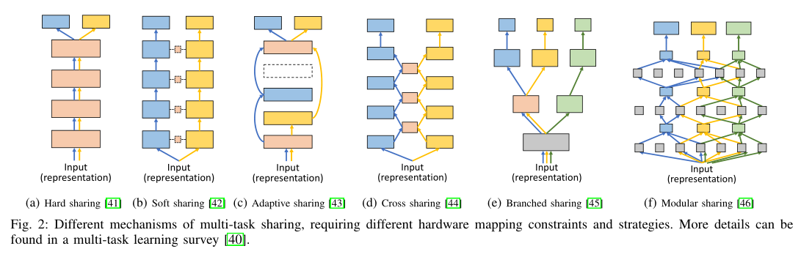
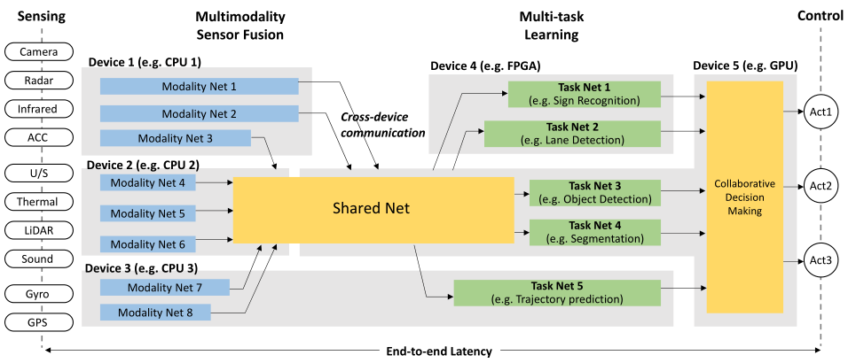

## 软硬件设计(Hardware/Software co-design)

* 什么是软硬件协同设计？
* 传统方法是什么？
* 软硬件系统设计相较于传统的设计有哪些优点？Classic H/S Design Process（为什么软硬件协同设计是未来的方式？软硬件协同设计的好处？）
* 软硬件协同设计目前常应用在什么领域中？（软硬件协同设计的整合？*这里要结合我们药谈到的两个项目来谈谈或者从下列参考资料中单独举出两个例子*）
* 软硬件协同设计的过程一般分为那些阶段？每个阶段具体做什么？仿真方法（*这里可以放到下一点，按照项目来说*）
* 软硬件协同设计中软硬件的划分方法

* 参考资料或文献：（结合里面谈到的H/S协同设计的框架和方法）

    + https://baike.baidu.com/item/%E8%BD%AF%E7%A1%AC%E4%BB%B6%E5%8D%8F%E5%90%8C%E8%AE%BE%E8%AE%A1/7654377?fr=aladdin#2 （*百度百科不要照抄，改一改语句，不然重复率会很高，结合它上面的框架，可以借鉴图*）

    + https://resources.pcb.cadence.com/blog/2019-what-is-hardware-software-co-design-and-how-can-it-benefit-you-or-your-business
  
    + https://www.sciencedirect.com/topics/engineering/hardware-software-codesign

    + **结合这篇综述，补充回答上面的问题** [[7]](#refer-anchor-7)

    + https://www.cs.ccu.edu.tw/~pahsiung/courses/soc/notes/SoC_Design_Flow_Tools_Codesign.pdf （*这个ppt中基本都提到上述问题，好好参考*）

    + https://semiengineering.com/software-hardware-co-design-becomes-real/

    + http://www.doc.ic.ac.uk/~wl/papers/05/sp05tw.pdf

    + https://www.npd-solutions.com/codesign.html

## 软硬件协同的具体项目

* 深度学习下神经网络的软硬件协同优化设计
    + RSNN：FPGAs上稀疏卷积神经网络的软硬件协同优化框架；
    + 从模型到FPGA：高效神经网络加速的软硬件协同设计
      + 我们需要讨论（*为什么软件需要硬件优化？作者在硬件上是怎么优化的？作者是怎样去验证这个软硬件协同效率的？硬件开发语言是什么？其软硬件优化的策略或过程是什么？有什么不同？*）

* 嵌入式系统的软硬件协同优化设计（一个例子即可）
    + 需要讲述传统嵌入式系统开发流程和嵌入式系统软硬件协同设计的区别；
    + 如何仿真验证？
    + 具体案例[[8]](#refer-anchor-8)[[9]](#refer-anchor-9)

## 文献综述
 
 * Hao[[1]](#refer-anchor-1)等讨论了在自制系统中应用MMMT（多模态多任务）技术的机会，讨论了应用MMMT技术所面临的挑战。作者在最后讨论了**MMMT模型和硬件协同设计的必要性和机会**，作者将其形式化地表述为一个优化问题，在可以通过协同设计提高解决方法质量并降低整体功耗和关键路径延迟。
    + MMMT模型结构极大地影响了总体计算复杂性和通信开销。如下图所示，各种MMMT模型具有很大不同的硬件计算和通信复杂度。
        -  

                

不同的多任务共享机制

            

        - (a)是传统的硬共享，其中不同的任务共享相同的网络参数和中间数据集，因此可以显著节省跨任务的计算和通信。
        - 相反，图(b)至(e)说明了其他流行的MMMT模型，这些模型引入了计算开销（例如软共享和串扰共享）、通信开销或控制开销（例如自适应共享和模块化共享），并且硬件部署效率可能会显著降低。
        - 自主系统通常具有MMMT模型设计所不知道的异构平台。例如，在自动驾驶汽车中，计算平台可以由GPU、CPU、FPGA、深度学习加速器、视觉加速器、图像信号处理器和视频编码器组成。从MMMT模型到硬件组件的不同映射解决方案可能导致很大程度上不同的硬件性能。
        - 除了深度学习模型的执行，传感器数据处理和跨设备通信等其他开销也对整体性能至关重要，因此不容忽视。下图显示了整个软件管道及其在硬件平台上的映射的示例。
        - 

                

软件在硬件平台上的映射

            

        - 自主系统的另一个关键设计指标是端到端延迟，特别是对于生命关键决策，如自动驾驶控制。如上图所示，预计在最终决策之前，不同任务输出的到达时间应该相同。因此，可以将不在关键路径上的任务分配给功能较弱的硬件组件，而必须更仔细地分配关键路径上任务，以减少端到端延迟。
    + 作者考虑到软件/硬件协同设计的必要性，提出了自动化MMMT模型和异构硬件实现协同搜索。
        - 作者认为MMMT模型与硬件协同设计问题的表述需满足下列要求：
          - 表述应涉及算法设计空间和硬件实现设计空间；
          - 应包括不同的目标函数以提供QoR和QoS权衡；
          - 该公式应可通过诸如离散或连续优化的优化技术求解；
    + 作者认为软硬件协同设计问题的目标是双重的，需要考虑如下目标：
        - 1）软件质量，即下列公式中描述的混合损失函数度量；$$\min ：\sum_{c\in C } {{Control\_Loss}_c+ \lambda \sum_{t\in T} {Task \_Loss}_t }$$ 
        - 2）总功耗，用所有有源硬件组件的功率之和来衡量；
        - 3）端到端延迟，用输入模式和输出任务对之间的最长路径来衡量；
        - 所以，作者认为MMMT模型和硬件协同设计问题可以表述为一个多目标优化问题。形式上，作者将MMMT模型和硬件实现协同搜索问题表述如下：
        - $$\min : Loss_{sw}(A_\alpha)+\gamma_1 \cdot Loss_{hw}(I_\omega) \\  \ \  \ \ \ \ \ \ \ \ \  \ \  \ s.t. \ Loss_{hw} = \max \{ {Lat_{xp(m,t)}| \forall m \in M, t \in T} \} + \gamma_2 \cdot \sum_{d \in D} Power(d)$$
          - 其中$m$为模态集M中的输入模态，$t$为任务集$T$中的具体任务输出；$D$是在最终部署中处于活动状态的硬件设备组件；$Power(d)$为其功耗；$xp(m, t)$是模态$m$到任务$t$的路径；$Lat_{xp(m, t)}$为硬件平台上从输入模态$m$到任务$t$的路径延迟；用$A$表示模型架构设计空间，参数化为$\omega$，$A_\alpha$的结果决定了QoR，$I_\omega$的结果决定了QoS；
        + 上式通过离散或连续优化来求解[[2]](#refer-anchor-2)[[3]](#refer-anchor-3)。另一种方法是放松离散分布（通过加权和或重参数化或统计抽样来求解$A_\alpha$），使其可微，然后采用连续优化技术，如梯度下降[[4]](#refer-anchor-4)。$I_\omega$的离散优化可以采用类似的再参数化和统计抽样技术，如下式：
          - $${\begin{aligned} Lat(\omega, \phi) &= \mathbb{E}_{XP \sim P_{\phi}(xp)}[f_{\omega}(XP)] \\& = \mathbb{E}_{Z \sim q(x)}[f_\omega(g_{\phi}(Z))] \end{aligned}}$$
          -  $\varphi$为原分布参数。$q(z)$是一个固定分布(如高斯分布)，$g_{\phi}(Z)$为变换函数，其中$Z$从分布$q(Z)$中采样，x从z通过确定性变换$x=g_{\phi}(Z)$计算，即重参数化技术。$f_\omega(\cdot)$为映射参数$\omega$下的延时函数。
 * Ishikawa等[[5]](#refer-anchor-5)提出了一种基于CPU模型的硬件/软件联合仿真的高可靠性实时嵌入式控制系统开发方法。它实现了微架构设计空间探索、控制设计验证、系统鲁棒性评估、组件设计前的软件优化，并防止一些潜在的问题。
    + 作者在开发环境中开发了一个集成的行为分析器。该分析器可以在不影响仿真结果的情况下图形化地显示模拟过程中的处理器行为，例如任务级别的CPU负载、中断统计和软件变量装换图。
    + 作者提出的这种方法适用于嵌入式系统设计，特别是对可靠性、鲁棒性、质量和安全性要求较高的汽车控制系统设计。
    + 本文中涉及到的$\mathbf{Renesas \ SH-2A}$微控制器模型是在来自$\mathbf{VaST \ Systems \ Technology}$的$\mathbf{CoMET^{TM}}$平台上开发的。

* Jang等[[6]](#refer-anchor-6)

## Reference

- [1] Hao, Cong, and Deming Chen. "Software/Hardware Co-design for Multi-modal Multi-task Learning in Autonomous Systems." 2021 IEEE 3rd International Conference on Artificial Intelligence Circuits and Systems (AICAS). IEEE, 2021.

- [2] Parker, R. Gary, and Ronald L. Rardin. Discrete optimization. Elsevier, 2014.d

- [3] M. J. Kochenderfer and T. A. Wheeler, Algorithms for optimization. Mit Press, 2019.

- [4] Kingma, Diederik P., and Max Welling. "Auto-encoding variational bayes." arXiv preprint arXiv:1312.6114 (2013).

- [5] Ishikawa, Makoto, et al. "CPU model-based hardware/software co-design, co-simulation and analysis technology for real-time embedded control systems." 13th IEEE Real Time and Embedded Technology and Applications Symposium (RTAS'07). IEEE, 2007.

- [6] Jang, Seojin, Wei Liu, and Yongbeom Cho. "Convolutional Neural Network Model Compression Method for Software—Hardware Co-Design." Information 13.10 (2022): 451.

- [7] G. De Michell and R. K. Gupta, "Hardware/software co-design," in Proceedings of the IEEE, vol. 85, no. 3, pp. 349-365, March 1997, doi: 10.1109/5.558708.

- [8] 徐杭. 基于视觉的车载行人检测系统软硬件协同设计. MS thesis. 广西师范大学, 2018.

- [9] 梁新宇. 基于 ZYNQ 的行人检测系统软硬件协同实现[D]. 大连海事大学, 2016.